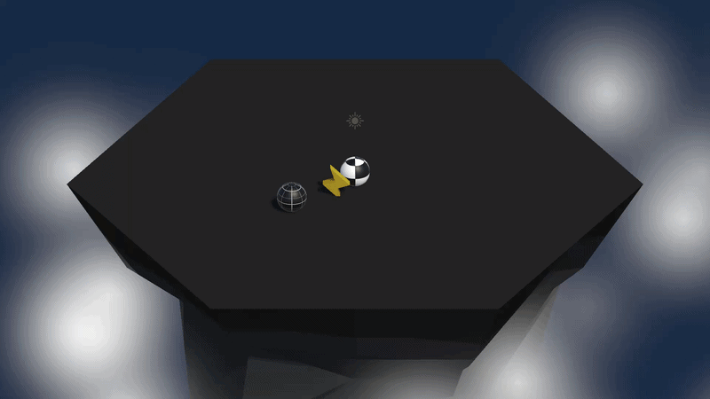

# Gameplay Mechanics

A hands-on Unity gameplay mechanics section where I built an arcade-style Sumo battle game while learning player movement, enemy AI, physics, powerups, prefabs, coroutines, and dynamic enemy waves.

  

## About

Gameplay Mechanics is the fourth section of Unity Technologies' official Junior Programmer learning pathway, designed to introduce more advanced gameplay programming concepts through a practical Unity project.

Throughout the section, I built an arcade-style Sumo battle prototype where the player fights increasingly difficult waves of enemies on a floating island. The main gameplay mechanic is pushing enemies off the island using physics-based movement and knockback.

I used Unity's Input System to control the player and implemented camera-based movement using a Focal Point. I also created enemy AI that follows the player and uses Rigidbody physics to interact with the player.

The project also introduced temporary powerups, coroutines, countdown timers, random spawning, prefabs, and dynamic enemy waves. These systems work together to create a complete gameplay loop with increasing difficulty.

## What I Learned

- Unity Input System and Input Actions
- Player movement using Rigidbody physics
- Camera rotation and Focal Point movement
- Global and Local coordinates
- Enemy AI and player chasing
- Physics Materials and knockback mechanics
- Prefabs and object instantiation
- Random enemy spawning
- Powerups and temporary abilities
- Coroutines and countdown timers
- Enemy wave systems and increasing difficulty
- C# methods, loops, conditions, and debugging

## Technologies

- Unity 6.3
- Unity Editor
- C#
- Unity Learn
- Unity Input System
- Input Actions
- GameObjects
- Components
- Rigidbody
- Colliders
- Physics Materials
- Camera

⭐ If you found this repository helpful, consider giving it a star!
