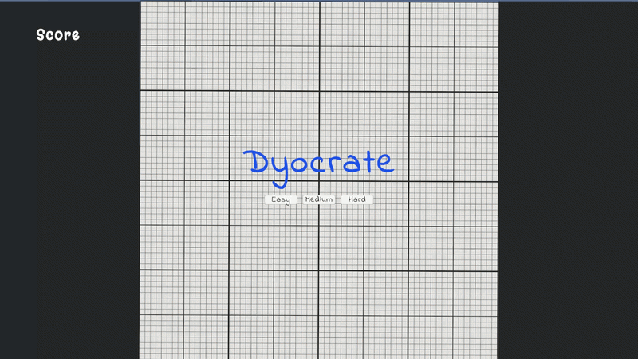

# User Interface

A hands-on Unity learning section where I built a reflex-based game while learning how to create and manage User Interfaces, game menus, score systems, difficulty settings, and game-over states.

  

## About

User Interface is the fifth section of Unity Technologies' official Junior Programmer learning pathway. This section focuses on creating a complete playable experience by introducing User Interface (UI) systems into a Unity game.

Throughout the section, I built a reflex-based gameplay prototype where the player must click and destroy objects that are randomly tossed into the air before they fall off the screen.

The project includes a title screen with a difficulty selection menu, a gameplay screen with a score display, and a Game Over screen that allows the player to restart the game without restarting the application.

This section helped me understand how UI elements can communicate game information to the player and how different game states can be connected to create a complete gameplay experience from start to finish.

## What I Learned

- Creating and managing Unity UI elements
- Canvas and UI hierarchy
- Text and score displays
- Buttons and button interactions
- Title screens and game menus
- Difficulty selection systems
- Game Over screens
- Restarting gameplay through UI
- Connecting UI elements with C# scripts
- Managing different game states
- Using common C# logic structures
- Debugging code and fixing gameplay issues

## Technologies

- Unity 6.3
- Unity Editor
- C#
- Unity Learn
- Unity UI
- Canvas
- Text and UI Elements
- Buttons
- Game States
- Unity Inspector
- Unity APIs

⭐ If you found this repository helpful, consider giving it a star!
