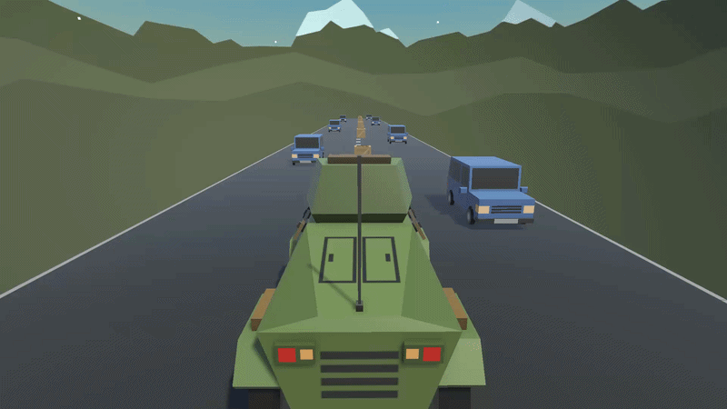
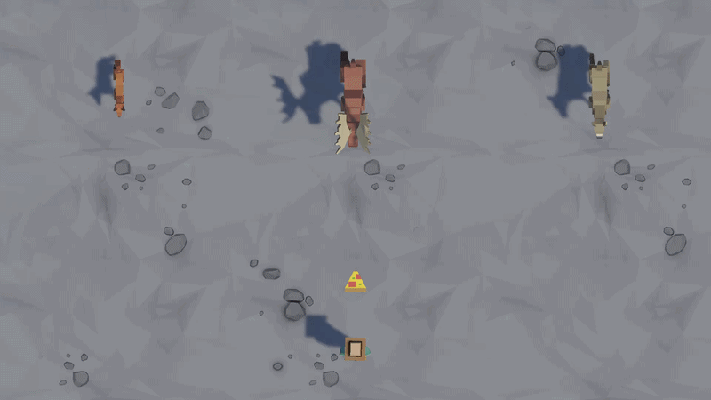

# Unity Junior Programmer

Welcome to my repository showcasing the projects I developed while completing the Unity Junior Programmer learning pathway.

## Completed Sections

1. [Player Control](#player-control)
2. [Basic Gameplay](#basic-gameplay)
3. [Sound and Effects](#sound-and-effects)

## Projects

1. ### <a name="player-control">Player Control</a>

**Project:** [Player Control](1-player-control/README.md)

  

**Description:** A car-based gameplay prototype where I learned the fundamentals of Unity, including GameObjects, Components, physics, C# scripting, variables, and trigger interactions.

2. ### <a name="basic-gameplay">Basic Gameplay</a>

**Project:** [Basic Gameplay](2-basic-gameplay/README.md)

  

**Description:** A top-down gameplay prototype where the player throws food at approaching animals. This section focused on conditional logic, arrays, random values, prefabs, instantiation, collision detection, and debugging.

3. ### <a name="sound-and-effects">Sound and Effects</a>

**Project:** [Sound and Effects](3-sound-and-effects/README.md)

  

**Description:** An endless side-scrolling runner where I learned how to implement player jumping, background music, sound effects, repeating backgrounds, particle effects, and gameplay feedback.

## What I Learned

- Unity Editor workflow
- GameObjects and Components
- Transform and Rigidbody physics
- Colliders and trigger interactions
- C# scripting fundamentals
- Variables and data types
- Conditional logic
- Arrays and random values
- Prefabs and object instantiation
- Projectile and spawning systems
- Input System
- Player movement and jumping
- Camera systems
- Audio and sound effects
- Particle effects
- Endless scrolling backgrounds
- Debugging and error handling
- Basic gameplay programming

## Technologies

- Unity 6.3
- Unity Editor
- C#
- Unity Learn
- Input System
- Physics
- GameObjects
- Components
- Prefabs
- Audio
- Particle System

## How to Navigate

Feel free to explore each section to learn more about my progress through the Unity Junior Programmer pathway.

Each section contains its own README with details about the project, concepts learned, and technologies used.

⭐ If you found this repository helpful, consider giving it a star!
