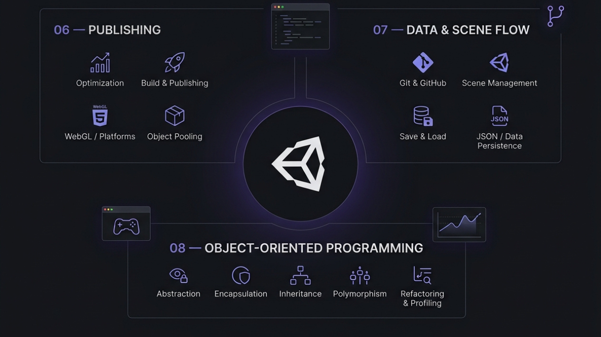

# Unity Junior Programmer

A hands-on Unity learning pathway where I built gameplay prototypes while developing my skills in C#, game mechanics, UI, physics, AI, data management, optimization, and object-oriented programming.

🏅 **My Unity Junior Programmer Badge:** https://www.credly.com/badges/213185e9-25cb-4add-b3b3-ea4d0164a2da/

## About

Unity Junior Programmer is Unity's learning pathway focused on developing practical programming skills for game development.

Throughout the pathway, I worked on multiple Unity projects and learned how to build gameplay systems using C#. I progressed from basic player control and physics to enemy AI, UI, game states, scene management, data persistence, optimization, and object-oriented programming.

The pathway helped me develop a stronger understanding of how different systems work together to create structured and interactive games.

## Game Demos

<table>
<tr>
<td width="33.33%" align="center">
 
<a href="1-player-control/README.md"><b>Player Control</b></a> 
A car-based game focused on movement and vehicle control.
</td>

<td width="33.33%" align="center">
 
<a href="2-basic-gameplay/README.md"><b>Basic Gameplay</b></a> 
A top-down game where the player throws food at animals.
</td>

<td width="33.33%" align="center">
 
<a href="3-sound-and-effects/README.md"><b>Sound and Effects</b></a> 
An endless runner with audio and visual effects.
</td>
</tr>

<tr>
<td width="33.33%" align="center">
 
<a href="4-gameplay-mechanics/README.md"><b>Gameplay Mechanics</b></a> 
An arcade-style Sumo battle with enemies, powerups, and physics.
</td>

<td width="33.33%" align="center">
 
<a href="5-user-interface/README.md"><b>User Interface</b></a> 
A reflex game with difficulty settings, scoring, and game states.
</td>

<td width="33.33%" align="center">
 
<b>Beyond Gameplay</b> 
Optimization, publishing, data management, and object-oriented programming.
</td>
</tr>
</table>

## Completed Sections

| №     | Section                              | What I Learned                                                                                                      | Navigation                                                                                                                                        |
| ----- | ------------------------------------ | ------------------------------------------------------------------------------------------------------------------- | ------------------------------------------------------------------------------------------------------------------------------------------------- |
| **1** | **Player Control**                   | Unity fundamentals, GameObjects, Components, physics, C# scripting, variables, and trigger interactions             |                    |
| **2** | **Basic Gameplay**                   | Conditional logic, arrays, random values, prefabs, instantiation, collision detection, and debugging                |                    |
| **3** | **Sound and Effects**                | Audio, particle effects, gameplay feedback, and creating more engaging player experiences                           |                 |
| **4** | **Gameplay Mechanics**               | Player movement, camera control, enemy AI, physics, powerups, coroutines, spawning systems, and dynamic enemy waves |                |
| **5** | **User Interface**                   | UI systems, menus, difficulty selection, score tracking, game states, and connecting UI elements with C#            |                    |
| **6** | **Publishing Your Project**          | Project optimization, troubleshooting, platform publishing, ECS, DOTS, and portfolio preparation                    |           |
| **7** | **Manage Scene Flow and Data**       | Git and GitHub, scene management, data persistence, saving and loading, JSON serialization, and OOP fundamentals    |        |
| **8** | **Apply Object-Oriented Principles** | Abstraction, encapsulation, inheritance, polymorphism, code refactoring, profiling, and optimization                |  |

## What I Learned

- Unity Editor workflow and project structure
- GameObjects, Components, Prefabs, and Scenes
- C# scripting fundamentals
- Variables, data types, methods, loops, and conditional logic
- Arrays and random values
- Physics, Rigidbody, Colliders, and triggers
- Player movement and Unity Input System
- Camera control and coordinate spaces
- Enemy AI and gameplay mechanics
- Powerups, coroutines, and spawning systems
- Dynamic enemy waves and gameplay difficulty
- Audio, particle effects, and gameplay feedback
- User Interface and game-state management
- Debugging and troubleshooting
- Project optimization and Object Pooling
- Performance profiling with Unity Profiler
- Building and publishing Unity projects
- Git and GitHub
- Scene management and data persistence
- Saving, loading, and JSON serialization
- Object-Oriented Programming principles
- Abstraction, encapsulation, inheritance, and polymorphism
- Code refactoring and access control
- ECS and DOTS
- Portfolio, career, and interview preparation

## Technologies

- Unity 6.3
- Unity Editor
- C#
- Unity Learn
- Unity Input System
- Input Actions
- GameObjects
- Components
- Prefabs
- Physics
- Rigidbody
- Colliders
- Physics Materials
- Unity UI
- Canvas
- UI Buttons
- Text & UI Elements
- Audio
- Particle System
- Camera
- Coroutines
- Object Pooling
- Build Profiles
- WebGL
- ECS
- DOTS
- Git
- GitHub
- JSON
- System.IO
- SceneManager
- DontDestroyOnLoad
- Unity Profiler
- Object-Oriented Programming

## What's Next

With the Unity Junior Programmer pathway completed, my next goal is to build more original Unity projects and continue improving my game programming skills.

I also want to explore the combination of **Game Development and AI/ML** by applying AI-related concepts to future game projects.

⭐ If you found this repository helpful, consider giving it a star!
